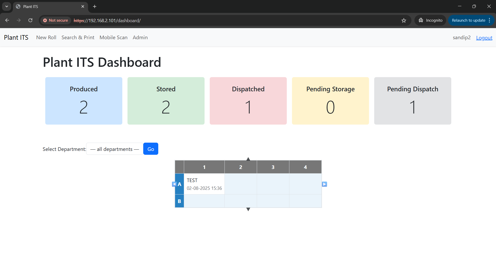
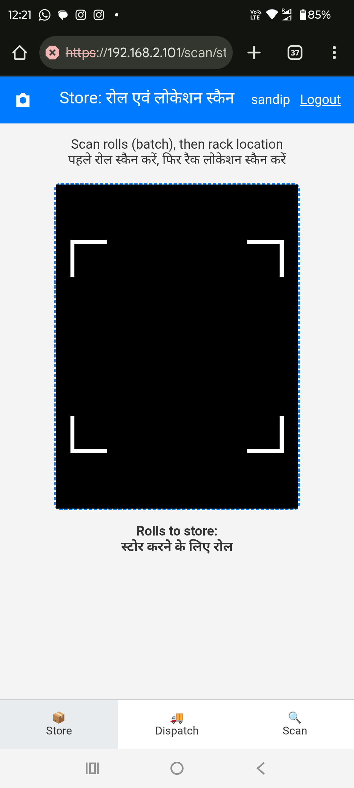
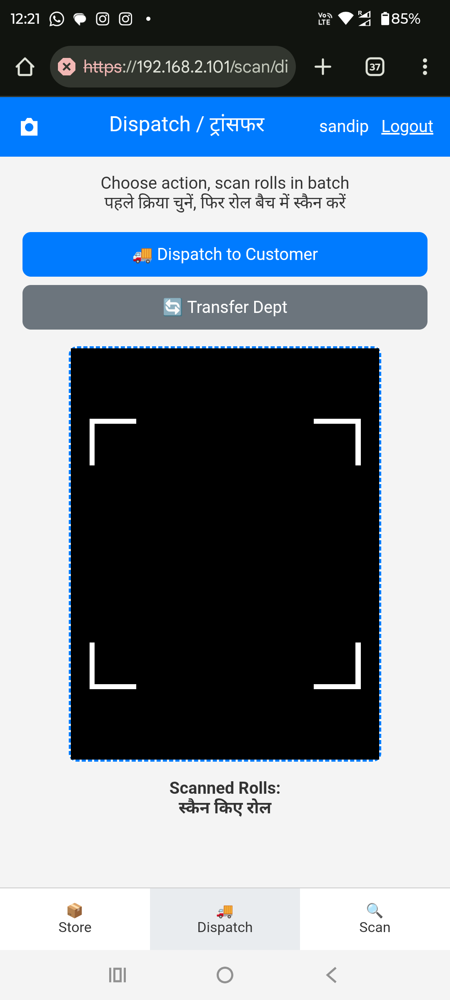
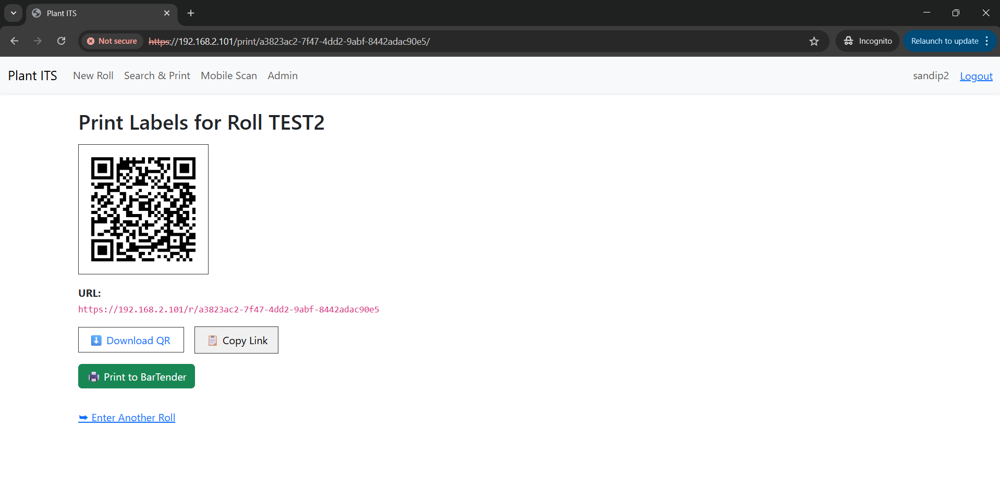
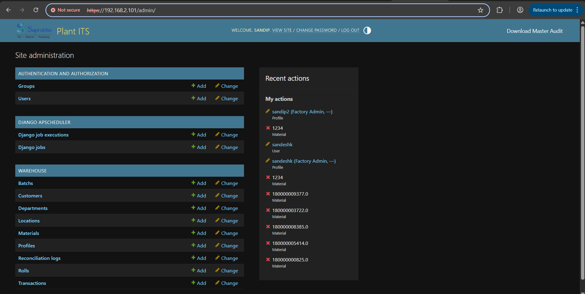

# Inventory Tracking System (ITS) / Plant WMS

[]()
[]()

## High-Level Summary

Inventory Tracking System (ITS) is a lightweight, pragmatic real-world solution for end-to-end visibility of manufactured rolls in a plant environment. It combines QR code scanning, role-based access, material entry (manual or bulk), and movement tracking (putaway, transfer, dispatch) to give operations and management real-time insight into inventory. The system is currently hosted on an internal Windows PC using Waitress + Caddy (HTTPS) and is designed for intranet deployment.

**Prepared by:** Sandip Sing  
**Date:** *03/08/2025*  
**Contact:** [LinkedIn](https://www.linkedin.com/in/sandip-sing/) / sandip.sing@iiml.org  

---

## Table of Contents

1. [Introduction](#introduction)  
2. [Key Features](#key-features)  
3. [Tech Stack](#tech-stack)  
4. [System Architecture & Design](#system-architecture--design)  
5. [Data Model](#data-model)  
6. [User & Role Management](#user--role-management)  
7. [URL Routing & Views](#url-routing--views)  
8. [REST API Overview](#rest-api-overview)  
9. [Admin Panel](#admin-panel)  
10. [Quickstart / Local Development](#quickstart--local-development)  
11. [Production Deployment (Windows Intranet)](#production-deployment-windows-intranet)  
12. [User Flows](#user-flows)  
13. [Screenshots / UI Gallery](#screenshots--ui-gallery)  
14. [Contributing](#contributing)  
15. [License & Courtesy Notification](#license--courtesy-notification)  
16. [Appendix: Troubleshooting & Tips](#appendix-troubleshooting--tips)

---

## Introduction

Manufacturing plants often suffer from visibility gaps between production, storage, internal transfers, and dispatch. ITS addresses this by making every physical roll traceable via a unique QR code and recording its lifecycle from creation to dispatch or transfer. The system is deliberately simple to operate from the shop floor (mobile scanning or plug-and-play barcode scanner), while giving managers aggregated dashboards and reconciliation to ensure a single source of truth.

---

## Key Features

- Material entry (manual or bulk Excel upload)
- Automatic QR label generation per roll
- Mobile-friendly scanning flows for:
  - Putaway (store rolls in rack locations)
  - Dispatch to customers
  - Transfer between departments
- Role-based dashboards and permissions
- Reconciliation job to detect mismatches (daily scheduled)
- Master audit export (Excel) with material + transaction history + summaries
- Plug-and-play hardware scanner support (keyboard-emulating)
- Camera-based mobile scanning with fallback
- Integration-ready for automated label printing (BarTender REST API)
- Intranet-ready secure hosting (HTTPS via Caddy + mkcert)

---

## Tech Stack

- **Backend:** Python, Django (MVT pattern)
- **Frontend:** Django templates, minimal vanilla JS (Html5Qrcode for camera scanning)
- **Database:** SQLite (development); can be replaced with PostgreSQL or others in production
- **Scheduled Jobs:** APScheduler via `django-apscheduler`
- **Label Printing Integration:** BarTender REST API
- **QR Code Generation:** `qrcode` Python library
- **Web Serving:** Waitress (WSGI) + Caddy reverse proxy with TLS
- **Service Management (Windows):** NSSM (Non-Sucking Service Manager)
- **Authentication & Permissions:** Django auth Groups + custom `Profile` model
- **Excel Export:** `openpyxl` for master audit
- **Bulk Upload / Processing:** `pandas` for Excel/CSV parsing

---

## System Architecture & Design

ITS follows the Django **Model-View-Template (MVT)** architecture:

- **Models:** Define core entities — Material, Batch, Roll, Transaction, Department, Profile, ReconciliationLog, etc.
- **Views:** Handle request logic:
  - TemplateViews for dashboard, print pages
  - FormView for batch/material entry
  - API endpoints (via Django views/serializers) for roll lookups and transaction creation
- **Templates:** HTML with embedded Django template logic for both desktop and mobile experiences.
- **Scheduler:** Background reconciliation job runs (e.g., daily at 9 AM) to compare dashboard vs underlying transactional data and log mismatches.
- **Reverse Proxy & TLS:** Caddy fronts the application providing HTTPS (using mkcert-generated certs for internal trust), forwards to Waitress serving Django.

Diagram (conceptual):

```

\[Shop Floor Mobile / Desktop] <--HTTPS--> \[Caddy TLS Reverse Proxy] <--HTTP--> \[Waitress WSGI] --> Django app
|
BarTender (label printing)
|
QR label on physical roll

````

---

## Data Model

Key models and relationships (simplified):

- `Material` (unique material_number)  
  - has `department`, `created_by`, `created_at`  
- `Batch`  
  - belongs to one `Material`  
  - unique per (material, batch_number)
- `Roll`  
  - belongs to one `Batch`  
  - has weight, current_location, status
- `Transaction`  
  - records actions (`PUTAWAY`, `DISPATCH`, `TRANSFER`) on a Roll  
  - has location, user, customer, scanned_at
- `Profile`  
  - extends Django `User` with department, requested_group, extra_access  
- `ReconciliationLog`  
  - result of automated job comparing expected versus actual
- `ImportLog` (if present)  
  - tracks bulk upload outcomes, skipped/failed rows

Relationships:  
`Roll` → `Batch` → `Material`  
`Transaction` → `Roll`  
`Profile` → `User`  
`Material` created in context of a department and user

---

## User & Role Management

The system uses Django's built-in auth plus a `Profile` model and Groups. Roles are represented as Group names:

- Factory Admin  
- Plant Manager  
- Stock Keeper  
- Operator  
- Forklift Driver  
- Dept SK  
- View Only  

**Superusers** are either given a privileged group (e.g., Factory Admin) or the mixin treats `is_superuser` as full access.

Profiles define a home department and optional `extra_access` (comma-separated additional department codes) for stock keepers.

Role effects:

- **Admins** can view all departments, choose department filters in dashboard.
- **Department Managers / Stock Keepers** see only their department's inventory (enhancement you can gate by detecting their profile.department and extra_access).
- **Operators / Drivers** have limited entry scopes and are prevented from entering data for other departments.

Group synchronization is done in `ProfileAdmin.save_model`: when someone sets `requested_group`, the underlying `User`'s groups are updated accordingly.

---

## URL Routing & Views

Some key routes:

- `/` – Dashboard (role-filtered, reconciliation alerts)
- `/material-entry/` – Entry form for new rolls / batch import
- `/print/<uuid:roll_id>/` – Print label page, shows QR + metadata
- `/scan/store/` – Mobile store/putaway flow
- `/scan/dispatch/` – Dispatch / transfer UI
- `/scan/view/` – Scan & view roll details
- `/admin/` – Django admin enhanced with export links
- `/api/rolls/<id>/` – Roll lookup (used by mobile flows)
- `/api/transactions/` – POST endpoint to record PUTAWAY, DISPATCH, TRANSFER

Views use mixins like `DeptPermissionMixin` to enforce role-based access.

---

## REST API Overview

Minimal JSON API endpoints used by mobile UI flows:

- **GET `/api/rolls/{roll_id}/`**  
  Verifies existence of a roll. Returns 200 OK if found.

- **POST `/api/transactions/`**  
  Payload example for putaway:
  ```json
  {
    "roll": "uuid",
    "action": "PUTAWAY",
    "location": "FM01A01",
    "user": "username"
  }
``

For dispatch:

```json
{
  "roll": "uuid",
  "action": "DISPATCH",
  "customer": "CustomerName",
  "user": "username"
}
```

For transfer:

```json
{
  "roll": "uuid",
  "action": "TRANSFER",
  "location": "DeptLocation",
  "user": "username"
}
```

Responses are expected to be standard HTTP codes; failures trigger alerts in the UI.

---

## Admin Panel

Enhanced Django admin includes:

* Material, Batch, Customer, Roll, Location, Transaction, Department, Profile, ReconciliationLog management.
* Custom admin action: download QR for a Location.
* `master_export` view injected into admin: exports an Excel workbook with:

  * Sheet 1: Materials + roll metadata + latest posting/dispatch
  * Sheet 2: Full transaction log (who did what, when)
  * Sheet 3: Summary aggregates (counts by action)
* Profile admin synchronizes group membership based on requested role.

---

## Quickstart / Local Development

Assumes you're on a machine with Python 3.11+ / Anaconda.

### 1. Clone the repo

```bash
git clone https://github.com/yourusername/your-repo-name.git
cd your-repo-name
```

### 2. Create environment & install

```bash
conda create -n its python=3.11 -y
conda activate its
pip install -r requirements.txt
```

*(Alternatively `python -m venv .venv && source .venv/bin/activate` on non-Anaconda)*

### 3. Settings

Copy/modify `.env` or edit `settings.py` (example variables):

```python
# Example settings you might set via env or directly
DEBUG = True
SECRET_KEY = 'replace-this-with-a-secure-key-in-prod'
SITE_URL = 'http://localhost:8000'
BT_HOST = 'your-bartender-host'         # for printing integration
BT_PORT = 5488                          # default BarTender REST API port
BT_LABEL_TEMPLATE = 'YourLabel.bt'       # BarTender label format name
BT_DEFAULT_PRINTER = 'ZebraPrinter'     # printer name
```

Set trusted origins if using HTTPS (in production):

```python
CSRF_TRUSTED_ORIGINS = ["https://192.168.2.101"]
ALLOWED_HOSTS = ["localhost", "192.168.2.101"]
```

### 4. Migrate & create superuser

```bash
python manage.py migrate
python manage.py createsuperuser
```

### 5. Run development server

```bash
python manage.py runserver
```

Visit `http://localhost:8000/` to see the dashboard. Login via `/admin/`.

---

## Production Deployment (Windows Intranet)

This system is currently deployed on a Windows PC (intranet) using:

* **Waitress** as a production-ready WSGI server
* **Caddy** reverse proxy for HTTPS termination (using mkcert locally trusted cert)
* **NSSM** to run the Django/Waitress process as a Windows service for resilience

### Simplified startup sequence

1. Activate environment:

   ```powershell
   conda activate its
   ```

2. Start Waitress:

   ```powershell
   waitress-serve --listen=*:8000 plant_wms.wsgi:application
   ```

3. Configure Caddy:

   * Install `mkcert`.
   * Generate cert:

     ```powershell
     mkcert 192.168.2.101 localhost 127.0.0.1
     ```
   * Caddyfile example:

     ```
     http://192.168.2.101 {
         redir https://{host}{uri} permanent
     }

     https://192.168.2.101 {
         reverse_proxy 127.0.0.1:8000
         tls ./192.168.2.101+2.pem ./192.168.2.101+2-key.pem
     }
     ```

4. Run Caddy:

   ```powershell
   .\caddy.exe run --config Caddyfile
   ```

5. Optional: Install NSSM to wrap `waitress-serve` as a service so it auto-restarts.

### Firewall

Allow the ports if needed:

```powershell
netsh advfirewall firewall add rule name="Allow HTTPS 443" dir=in action=allow protocol=TCP localport=443
netsh advfirewall firewall add rule name="Allow Django 8000" dir=in action=allow protocol=TCP localport=8000
```

---

## User Flows

1. **Material Entry**

   * Admin/Stock Keeper uploads Excel or enters manually.
   * Material, Batch, Roll created; QR code generated.
   * Redirect to print label page.

2. **Storing Rolls (Putaway)**

   * Mobile screen: Scan roll(s), then rack location.
   * System posts `PUTAWAY` transactions.

3. **Dispatch**

   * Select Dispatch or Transfer.
   * Provide customer name or target department.
   * Scan rolls and confirm action.

4. **Dashboard**

   * Shows produced, stored, dispatched, pending counts.
   * Grid view of rack locations with roll summaries.
   * Department filtering (admin/semi-admin roles).

5. **Reconciliation**

   * Scheduled job compares sources; logs mismatches.
   * Alert appears for the admin for investigation.

---

## Screenshots / UI Gallery


### Dashboard



### Mobile Store Flow



### Dispatch / Transfer



### Print Label Page



### Admin Export & Logs



---

## Contributing

You’re welcome to use, fork, and adapt this project.

If you:

* Use it in a real deployment
* Build upon it
* Modify or redistribute

**Please courtesy notify** the author via email (`sandip.sing@iiml.org`) or [LinkedIn](https://www.linkedin.com/in/sandip-sing/) with a short note. This is *not* a legal requirement (the license is permissive), but it helps with collaboration, recognition, and potential feedback.

Pull requests, issues, and improvements are appreciated.

---

## License & Courtesy Notification

**Primary License:** [MIT License](./LICENSE)

You may use, copy, modify, merge, publish, distribute, sublicense, and/or sell copies of the Software under the MIT terms.

**Courtesy Request:**
If you deploy this system, adapt it, or use it to solve a real-world problem, kindly inform the author:

* Email: `sandip.sing@iiml.org`
* LinkedIn: [https://www.linkedin.com/in/sandip-sing/](https://www.linkedin.com/in/sandip-sing/)

This helps with visibility, feedback, and potential collaboration.

---

## Appendix: Troubleshooting & Tips

### Camera not working on mobile

* HTTPS is required for camera access on many browsers. Use Caddy with TLS (mkcert for internal trust).
* Ensure CSRF trusted origins include the correct scheme and host if behind reverse proxy.

### Static files missing in admin

* Run:

  ```bash
  python manage.py collectstatic
  ```
* Ensure `STATIC_ROOT` is configured and that Caddy/Waitress serves static files or use WhiteNoise in Django for self-contained static serving.

### Background reconciliation job

* Configured via `django_apscheduler` in `warehouse/apps.py` using textual reference (`"warehouse.apps:reconcile_roll_counts"`)
* Logs mismatches to `ReconciliationLog`.

### Role-based visibility

* Add superusers to “Factory Admin” or adjust `DeptPermissionMixin` to treat `is_superuser` as full access.

---

## Useful Commands Summary

```bash
# migrations
python manage.py migrate

# superuser
python manage.py createsuperuser

# collect static
python manage.py collectstatic

# run development
python manage.py runserver

# production WSGI
waitress-serve --listen=*:8000 plant_wms.wsgi:application
```

---

## Contact

**Sandip Sing**
Email: [sandip.sing@iiml.org](mailto:sandip.sing@iiml.org)
LinkedIn: [https://www.linkedin.com/in/sandip-sing/](https://www.linkedin.com/in/sandip-sing/)

---

